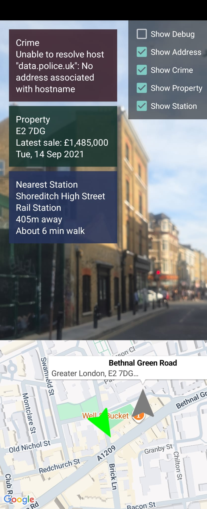
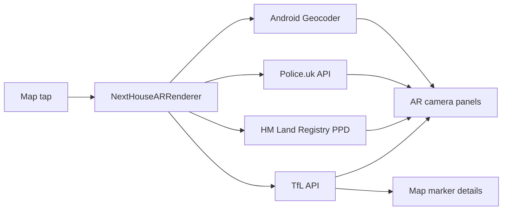

# NextHouse AR

Android AR app that lets you tap a location on the map and see nearby housing and crime context over the camera view.

## Architecture

## Flow

1. ARCore tracks the device and updates the map with the current camera position.
2. The user taps a map location.
3. The app geocodes the tap to a street and postcode.
4. The selected location gets an AR billboard card that stays anchored in camera space as you move.
5. Optional camera overlay panels can be toggled on:
   - Crime: public Police.uk street-level reports near the selected lat/lng.
   - Property: latest sale price and date from HM Land Registry Price Paid Data by postcode.
   - Nearest station: closest TfL rail or Tube station, distance, and walking time.
6. The map marker still shows address and enabled context.

## Data Sources

- Crime: `https://data.police.uk/api/crimes-street/all-crime`
- Property sale price/date: `https://landregistry.data.gov.uk/data/ppi/transaction-record.json`
- Transport: `https://api.tfl.gov.uk/StopPoint`
- Geocoding: Android `Geocoder`

No paid third-party property/crime API is used.

## Acknowledgement

- Build at London Data House 0 Hackathon (Aug, 2026)
- Bugs, Feature Requests, questions are all welcome!
